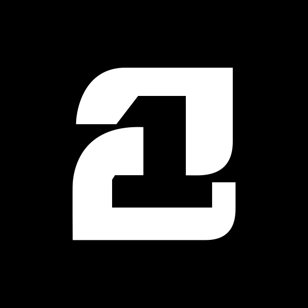
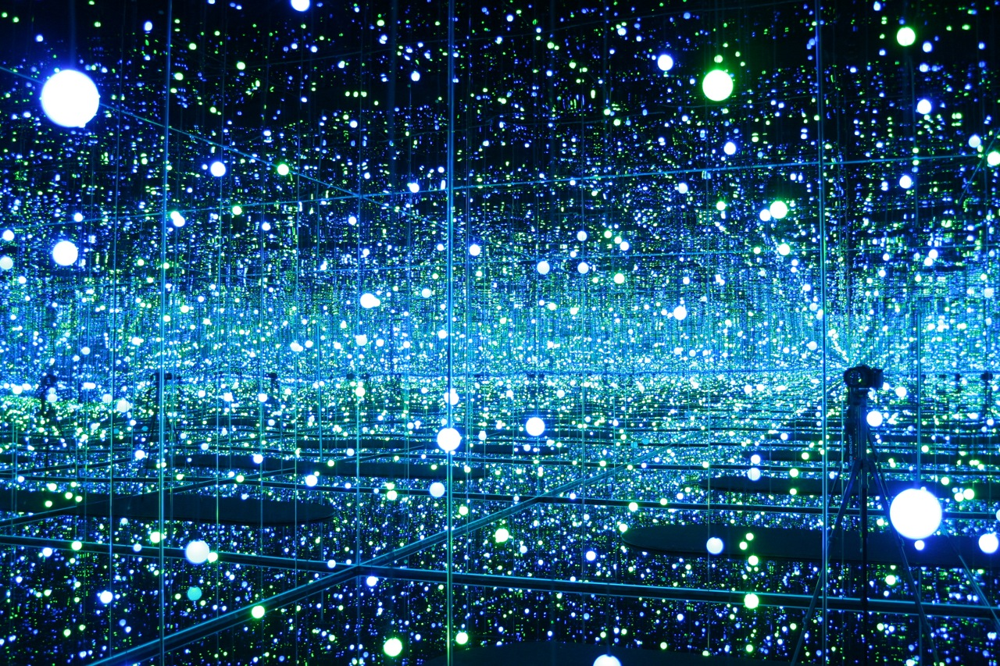
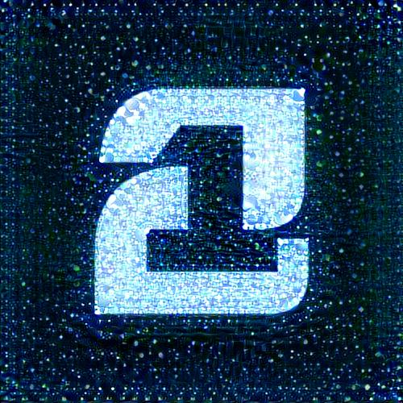
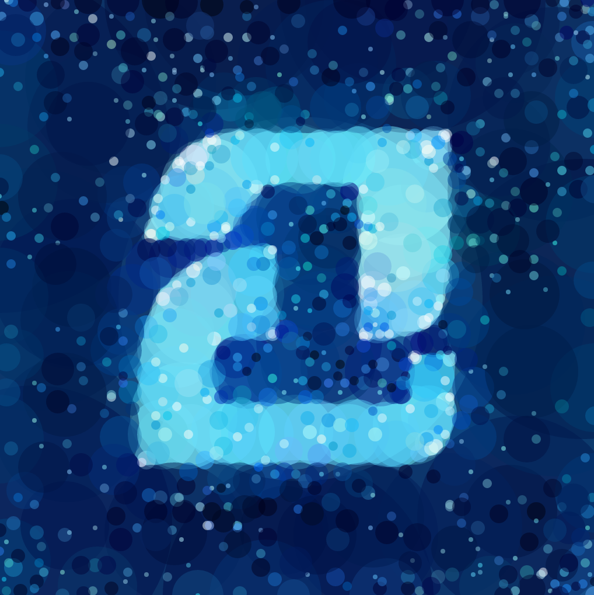

# Logo stylizer

Original logo (already takes huge artistic talent to design)

Style image

Above two processed with a neural network style transfer algorithm

Great, but two problems:

 1. Resolution is way too small for print, any larger exceeds memory limits
 2. Neural networks produce a lot of local patterns that appear as artefacts
 3. Distribution of patterns is too dense/sparse, misses the spirit of the style
 4. Color profile is not quite right

I adjusted the color profile slightly to bring out the nice blues. Then used an
optimization algorithm to recreate the image using only semi-transparent
circles, and rendered it as an (infinitely scalable) svg.

I rasterized the image at 9k x 9k pixels as a `.tiff` file (300ppi at 30 in x
30 in). Took it to a giclée printer (Berkeley Giclée, best value in the bay
area), and had it printed.

Mounted it in my company's foyer.

